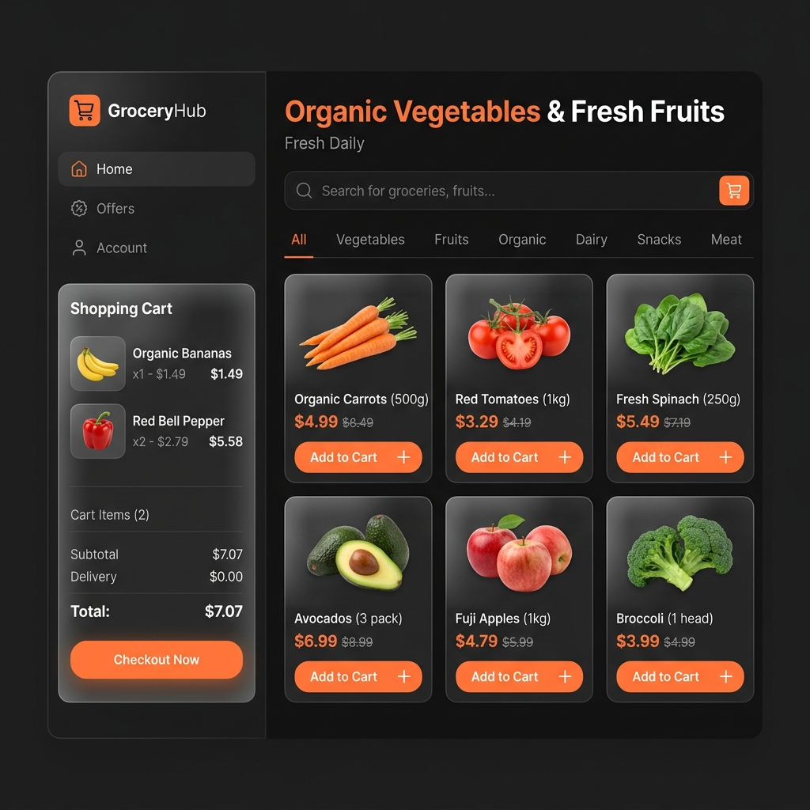
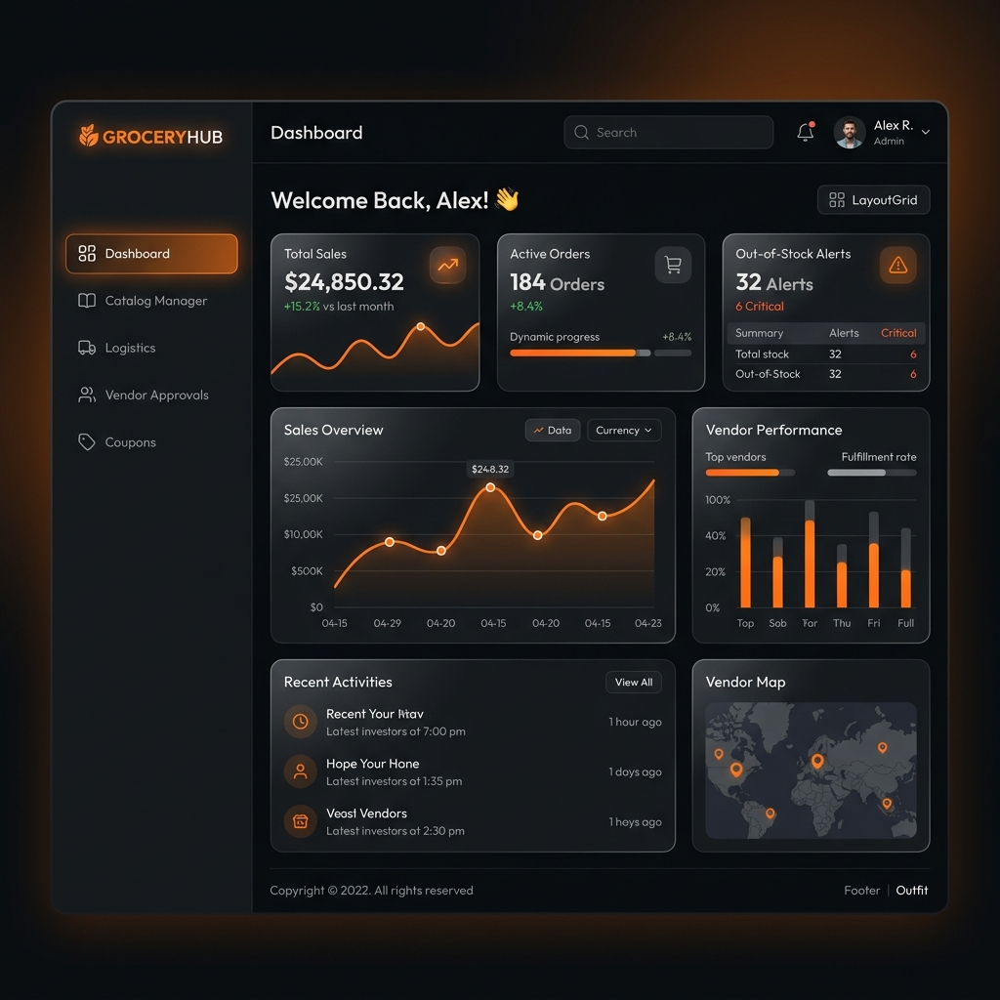
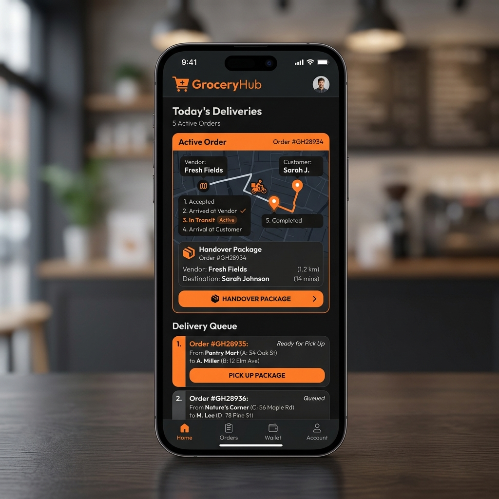
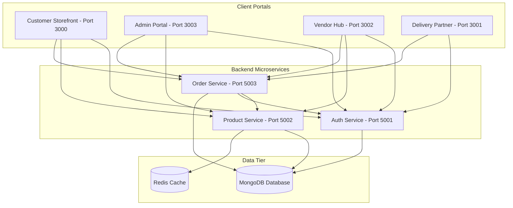

# 🍊 GroceryHub

Welcome to **GroceryHub**, a premium, modern, multi-user Grocery Platform featuring a synchronized logistics and order fulfillment lifecycle across all user portals. Built with **React** for client SPAs, styled using custom **Vanilla CSS** with a harmonious black-and-orange theme, and backed by a **Node.js/Express** microservices architecture orchestrated via **Docker Compose**.

---

## 📸 Platform Portals

Here is a look at the various portals within the GroceryHub platform:

### 🛒 Customer Storefront (Port 3000)
A premium dark-mode shopping experience with glassmorphic item cards, discount tags, category tabs, and an order milestone tracker timeline.


### 📊 Admin Portal (Port 3003)
The command center containing analytics dashboards, product editors, logistics validation trackers, vendor approvals, and coupon managers.


### 🚚 Delivery Partner App (Port 3001)
A mobile-optimized queue tracking deliveries, picking up packages, map transit trackers, and completing handovers.


---

## ⚙️ System Architecture & Services

GroceryHub is built as a set of decoupled microservices and independent frontend portals communicating via REST APIs:



### Port Mapping & Purpose

| Port | Service Name | Tech Stack | Description |
| :--- | :--- | :--- | :--- |
| **27017** | `mongodb` | MongoDB 6.0 | Persistent data storage shared across services. |
| **6379** | `redis` | Redis Alpine | Fast caching layer for catalog requests. |
| **5001** | `auth-service` | Node / Express / Mongoose | Manages user registration, JWT logins, and approvals. |
| **5002** | `product-service`| Node / Express / Redis | Handles catalog query caching and vendor inventories. |
| **5003** | `order-service` | Node / Express / Axios | Validates stock levels, handles checkout, and evaluates coupons. |
| **3000** | `frontend` | React / Vite / Nginx | Portal for customers to browse, cart, and buy items. |
| **3001** | `delivery-partner`| React / Vite / Nginx | Portal for drivers to accept orders and track delivery routes. |
| **3002** | `vendor` | React / Vite / Nginx | Portal for vendors to approve inventory requests. |
| **3003** | `admin` | React / Vite / Nginx | Control panel to manage catalog, vendors, coupons, and orders. |

---

## 🚀 DevOps Implementation & Configuration

All environment variables have been fully internalized into the Docker Compose configurations to enable immediate local orchestration without manually maintaining `.env` files across subdirectories.

### Run Local Development (Build from Source)
To run and build all services dynamically from your local codebase directory:
```bash
docker compose -f src/docker-compose.dev.yml up --build
```

### Run Production (Serve Built Registry Images)
To fetch and run pre-built registry images:
```bash
docker compose -f src/docker-compose.yaml up -d
```

### Hardened Docker Security (DevOps Ready)
- **Non-Root Isolation:** The Node backend microservices execute under the `node` user, and the frontend portals execute Nginx under the non-privileged `nginx` user to mitigate runtime exploits.
- **Image Size Minimization:** Double-stage builds are implemented for the frontend to prevent bundle tools from leaking to production.
- **Context Boundaries:** Dedicated `.dockerignore` files are located in all service roots to prevent leaking local development secrets (`.env`) or heavy folders (`node_modules`) into production images.
- **Microservice Healthchecks:** Docker Engine monitors liveness probes using Alpine-native `wget` triggers pointing to individual service `/health` endpoints.

---

## 🛠️ Microservice Life Cycle Synchronization

A background polling hook running on all frontends triggers active order details fetch operations every `3 seconds`. This permits status updates (Placed $\rightarrow$ Validated $\rightarrow$ Prepared $\rightarrow$ Transit $\rightarrow$ Delivered) to sync seamlessly across customer, vendor, admin, and driver portals without requiring full page refreshes.
