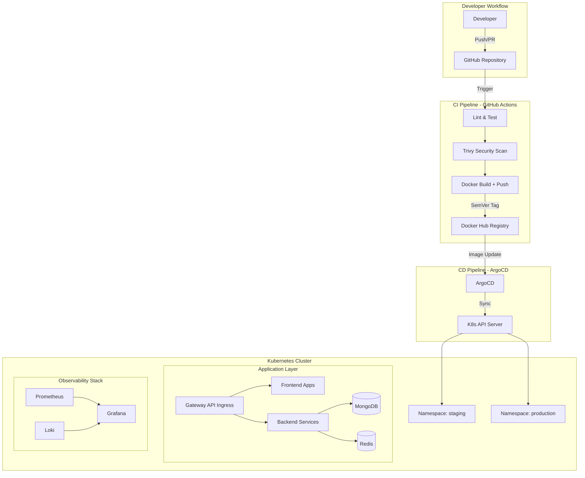
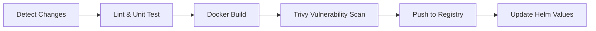
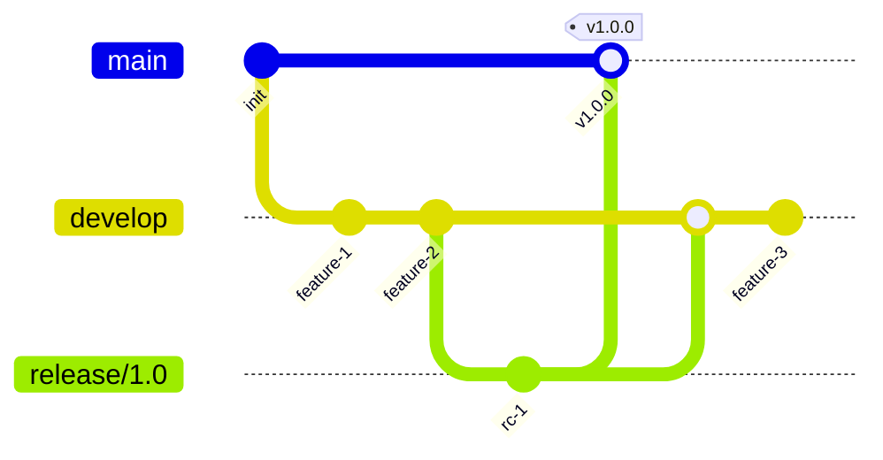

# Production-Level DevOps Implementation Plan for GroceryHub

## Current State Assessment

| Area | Current State | Production Gap |
|---|---|---|
| **Docker Images** | Basic single-stage (backend), multi-stage (frontend) Dockerfiles. No `.dockerignore`. | No security hardening, no non-root user, no healthchecks, bloated contexts |
| **CI/CD** | 5 GitHub Actions workflows — CI only (build + push `:latest`). No tests, no versioning. | No semantic tags, no CD, no test stage, no vulnerability scanning |
| **Container Registry** | Docker Hub (`biswajit134/*`) | Only `:latest` tag — no rollback capability |
| **Orchestration** | `docker-compose.yaml` (prod images) + `docker-compose.dev.yml` (build from source) | Not suitable for production — no health checks, restart policies, resource limits |
| **Kubernetes** | Helm chart templates existed but directory is now deleted | No K8s manifests at all |
| **Secrets** | Hardcoded `JWT_SECRET` in compose and source code | No secrets management |
| **Monitoring** | `/health` endpoint on product-service only | No centralized logging, metrics, or alerting |
| **Branching** | Single `main` branch, direct pushes | No environment promotion, no PR gates |
| **IaC** | None | No reproducible infrastructure |

---

## Proposed Architecture



---

## Phase 1: Docker Hardening

Harden all Dockerfiles and add `.dockerignore` files to reduce image size, improve build speed, and enhance security.

### Backend Services (auth, product, order)

#### [MODIFY] [Dockerfile](file:///e:/Devops%20practice/project/Grocery-app/src/services/auth-service/Dockerfile) (pattern for all 3)

- Add `NODE_ENV=production` build arg
- Run as non-root user (`node`)
- Add `HEALTHCHECK` instruction
- Pin exact base image digest for reproducibility
- Add `.dockerignore` alongside each Dockerfile

Example target state:
```dockerfile
FROM node:20-alpine

ENV NODE_ENV=production
WORKDIR /usr/src/app

COPY package*.json ./
RUN npm ci --only=production && npm cache clean --force

COPY . .

USER node
EXPOSE 5001

HEALTHCHECK --interval=30s --timeout=3s --retries=3 \
  CMD wget -qO- http://localhost:5001/health || exit 1

CMD ["node", "src/index.js"]
```

#### [NEW] `.dockerignore` (one per service + one per frontend app, 7 total)

```
node_modules
npm-debug.log
.env
.git
.gitignore
README.md
Dockerfile
```

### Frontend Apps (frontend, admin, vendor, delivery-partner)

#### [MODIFY] Frontend Dockerfiles

- Add build ARGs for `VITE_*` env vars so they can be injected at build time
- Run nginx as non-root
- Add `HEALTHCHECK`

---

## Phase 2: CI/CD Pipeline Overhaul

Replace the existing 5 simple CI workflows with a unified, production-grade pipeline.

### [DELETE] Existing workflow files
- `admin-ci.yaml`, `deliveryApp-ci.yaml`, `frontend-ci.yaml`, `sevices-ci.yaml`, `vender-ci.yaml`

### [NEW] `.github/workflows/ci-cd.yaml` — Unified CI/CD Pipeline

**Trigger:** Push to `main`, `develop`, `release/*` branches + PRs to `main`

**Pipeline stages:**



Key design decisions:
1. **Change detection matrix** — Use `dorny/paths-filter` to build only changed services (saves runner minutes)
2. **Semantic versioning** — Tag images as `<service>:<sha-short>` for traceability + `<service>:latest` for convenience
3. **Build matrix** — All 7 services in a single workflow using a matrix strategy
4. **Security scanning** — `aquasecurity/trivy-action` on every built image
5. **Helm values update** — Auto-update image tags in Helm `values.yaml` and commit (GitOps trigger for ArgoCD)

### [NEW] `.github/workflows/pr-checks.yaml` — PR Quality Gates

- Run linting, unit tests
- Docker build (without push) to verify Dockerfiles
- Comment build status on PR

---

## Phase 3: Helm Chart for Kubernetes

Create a complete Helm chart to deploy all services to Kubernetes.

### [NEW] `helm/groceryhub/Chart.yaml`

```yaml
apiVersion: v2
name: groceryhub
version: 1.0.0
appVersion: "1.0.0"
description: GroceryHub microservices platform
```

### [NEW] `helm/groceryhub/values.yaml`

Centralized configuration with per-environment overrides:

```yaml
global:
  imageRegistry: docker.io/biswajit134
  imagePullPolicy: IfNotPresent
  jwtSecret: ""  # Provided via sealed-secret

mongodb:
  enabled: true
  port: 27017
  persistence:
    size: 10Gi
    storageClass: ""

redis:
  enabled: true
  port: 6379
  persistence:
    size: 2Gi

authService:
  replicaCount: 2
  image:
    tag: latest
  port: 5001
  resources:
    requests: { cpu: 100m, memory: 128Mi }
    limits: { cpu: 250m, memory: 256Mi }

# ... similar for productService, orderService, frontend, admin, vendor, deliveryPartner
```

### [NEW] `helm/groceryhub/templates/` — Kubernetes Manifests

| File | Purpose |
|---|---|
| `_helpers.tpl` | Template helpers (fullname, labels, selectors) |
| `configmap.yaml` | Non-sensitive config (service URLs, ports) |
| `secrets.yaml` | Sensitive values (JWT secret via SealedSecrets) |
| `mongodb-*.yaml` | Deployment, Service, PVC for MongoDB |
| `redis-*.yaml` | Deployment, Service, PVC for Redis |
| `auth-service-deployment.yaml` | Deployment with health checks, resource limits, env from ConfigMap/Secret |
| `auth-service-service.yaml` | ClusterIP Service |
| `auth-service-hpa.yaml` | HorizontalPodAutoscaler (scale 2→5 at 70% CPU) |
| (same pattern for product-service, order-service) | |
| `frontend-deployment.yaml` | Frontend deployment |
| `frontend-service.yaml` | ClusterIP Service |
| (same pattern for admin, vendor, delivery-partner) | |
| `gateway.yaml` | Kubernetes Gateway API Gateway resource |
| `httproute.yaml` | HTTPRoute rules for path-based routing |

### [NEW] `helm/groceryhub/values-staging.yaml` + `values-production.yaml`

Environment-specific overrides (replica counts, resource limits, domain names).

---

## Phase 4: Secrets Management

### Strategy: Bitnami Sealed Secrets

> [!IMPORTANT]
> This replaces the current hardcoded `JWT_SECRET` in compose files and source code.

1. Install Sealed Secrets controller in the cluster
2. Encrypt secrets client-side with `kubeseal`
3. Store encrypted `SealedSecret` manifests in Git (safe to commit)
4. Controller decrypts them into regular K8s `Secrets` at runtime

### [NEW] `helm/groceryhub/templates/sealed-secret.yaml`

```yaml
apiVersion: bitnami.com/v1alpha1
kind: SealedSecret
metadata:
  name: {{ include "groceryhub.fullname" . }}-secrets
spec:
  encryptedData:
    JWT_SECRET: <sealed-value>
```

### [NEW] `scripts/seal-secrets.sh`

Helper script to create/update sealed secrets.

---

## Phase 5: Kubernetes Gateway API Ingress

### [NEW] `helm/groceryhub/templates/gateway.yaml`

```yaml
apiVersion: gateway.networking.k8s.io/v1
kind: Gateway
metadata:
  name: groceryhub-gateway
spec:
  gatewayClassName: nginx  # or istio, depending on cluster setup
  listeners:
    - name: http
      port: 80
      protocol: HTTP
    - name: https
      port: 443
      protocol: HTTPS
      tls:
        mode: Terminate
        certificateRefs:
          - name: groceryhub-tls
```

### [NEW] `helm/groceryhub/templates/httproute.yaml`

Path-based routing:

| Path | Service |
|---|---|
| `/` | frontend (port 3000) |
| `/admin` | admin (port 3003) |
| `/vendor` | vendor (port 3002) |
| `/delivery` | delivery-partner (port 3001) |
| `/api/auth/*` | auth-service (port 5001) |
| `/api/products/*` | product-service (port 5002) |
| `/api/orders/*` | order-service (port 5003) |

---

## Phase 6: Health Checks & Observability

### Health Check Endpoints

#### [MODIFY] Backend Services — Add `/health` and `/ready` endpoints

- `auth-service` and `order-service` currently lack health endpoints — add them
- `/health` = liveness (is the process alive?)
- `/ready` = readiness (are DB connections established?)

#### K8s Probe Configuration (in Helm deployment templates)

```yaml
livenessProbe:
  httpGet:
    path: /health
    port: {{ .Values.authService.port }}
  initialDelaySeconds: 15
  periodSeconds: 30
readinessProbe:
  httpGet:
    path: /ready
    port: {{ .Values.authService.port }}
  initialDelaySeconds: 5
  periodSeconds: 10
```

### Observability Stack

> [!NOTE]
> This phase can be implemented incrementally. Start with Prometheus + Grafana, add Loki later.

### [NEW] `helm/monitoring/` — Observability Helm Chart (or use community charts)

| Tool | Purpose | Implementation |
|---|---|---|
| **Prometheus** | Metrics collection | `kube-prometheus-stack` community chart |
| **Grafana** | Dashboards & alerting | Bundled with kube-prometheus-stack |
| **Loki** | Log aggregation | `grafana/loki-stack` community chart |
| **Alert Rules** | Proactive incident detection | Custom PrometheusRule CRDs |

### [NEW] Custom Grafana Dashboards

- `dashboards/groceryhub-overview.json` — Service health, request rates, error rates
- `dashboards/mongodb-metrics.json` — DB performance
- `dashboards/redis-metrics.json` — Cache hit rates

### Alerting Rules

```yaml
- alert: HighErrorRate
  expr: rate(http_requests_total{status=~"5.."}[5m]) > 0.05
  for: 5m
  labels:
    severity: critical

- alert: PodCrashLooping
  expr: rate(kube_pod_container_status_restarts_total[15m]) > 0
  for: 5m
  labels:
    severity: warning
```

---

## Phase 7: Branching Strategy & GitOps CD

### Git Branching Model



| Branch | Purpose | Deploys to |
|---|---|---|
| `feature/*` | New features | — (PR checks only) |
| `develop` | Integration | Staging namespace |
| `release/*` | Release candidates | Staging (manual promote to prod) |
| `main` | Production-ready | Production namespace |

### GitOps with ArgoCD

### [NEW] `argocd/` directory

```
argocd/
├── application-staging.yaml      # ArgoCD Application for staging
├── application-production.yaml   # ArgoCD Application for production
├── appproject.yaml              # ArgoCD AppProject with RBAC
└── README.md                    # Setup instructions
```

**How it works:**
1. CI pipeline builds image → pushes to registry → updates `values-staging.yaml` image tag
2. ArgoCD detects the Git commit → auto-syncs staging
3. After QA approval → PR merges `values-staging.yaml` tag into `values-production.yaml`
4. ArgoCD syncs production (manual sync with approval gate)

---

## Phase 8: Infrastructure as Code (Terraform)

> [!IMPORTANT]
> **Decision needed:** Which cloud provider will you use? The plan below uses AWS EKS as the example, but can be adapted to Azure AKS or Google GKE.

### [NEW] `terraform/` directory

```
terraform/
├── environments/
│   ├── staging/
│   │   ├── main.tf
│   │   ├── variables.tf
│   │   └── terraform.tfvars
│   └── production/
│       ├── main.tf
│       ├── variables.tf
│       └── terraform.tfvars
├── modules/
│   ├── eks-cluster/        # K8s cluster
│   ├── vpc/                # Networking
│   ├── ecr/                # Container registry (if moving off Docker Hub)
│   └── monitoring/         # CloudWatch / managed Prometheus
└── backend.tf              # Remote state in S3 + DynamoDB lock
```

**Resources provisioned:**
- VPC with public/private subnets
- EKS cluster with managed node groups
- IAM roles and policies
- ECR repositories (optional — can keep Docker Hub)
- S3 bucket for Terraform state

---

## User Review Required

> [!IMPORTANT]
> **Cloud Provider Selection:** Which cloud provider do you want to target?
> - **AWS** (EKS + ECR + Route53)
> - **Azure** (AKS + ACR + Azure DNS)
> - **Google Cloud** (GKE + Artifact Registry + Cloud DNS)
> - **Self-hosted** (k3s / kubeadm on VPS like DigitalOcean / Hetzner)
>
> This affects Terraform modules, ingress controller choice, and TLS certificate management.

> [!IMPORTANT]
> **Container Registry:** Stay with Docker Hub or migrate to a cloud-native registry (ECR/ACR/Artifact Registry)?
> Docker Hub has rate limits on free tier that can cause production outages.

> [!WARNING]
> **Secrets in Git:** The current codebase has `JWT_SECRET=supersecretjwtkeyforgroceryhub` hardcoded in both `docker-compose.yaml` files and as a fallback in source code. This MUST be rotated before going to production.

## Open Questions

1. **Do you have an existing Kubernetes cluster**, or should we provision one from scratch?
2. **Domain name** — Do you have a domain for the application (e.g., `groceryhub.com`)?
3. **TLS certificates** — Use Let's Encrypt (free, automated) or bring your own?
4. **Which phases do you want to implement first?** I recommend this order:
   - Phase 1 (Docker Hardening) → Phase 2 (CI/CD) → Phase 3 (Helm) → Phase 5 (Ingress) → Phase 4 (Secrets) → Phase 6 (Observability) → Phase 7 (GitOps) → Phase 8 (Terraform)
5. **Budget constraints?** Some observability tools (Datadog, New Relic) have costs. The plan uses fully open-source tools (Prometheus/Grafana/Loki).

---

## Verification Plan

### Automated Tests
```bash
# Validate Dockerfiles build successfully
docker compose -f src/docker-compose.yaml build

# Validate Helm chart syntax
helm lint helm/groceryhub/
helm template groceryhub helm/groceryhub/ --values helm/groceryhub/values-staging.yaml

# Dry-run Kubernetes deployment
kubectl apply --dry-run=client -f <rendered-manifests>

# Validate Terraform
cd terraform/environments/staging && terraform validate && terraform plan

# Run CI pipeline on a feature branch
git checkout -b test/devops-pipeline && git push origin test/devops-pipeline
```

### Manual Verification
- Deploy to staging namespace and verify all services are reachable
- Test horizontal pod autoscaling under load
- Verify ArgoCD auto-sync on image tag change
- Confirm Grafana dashboards show real-time metrics
- Simulate a failure (kill a pod) and verify self-healing + alerting
